# EduPath AI — Model & System Architecture

**An AI-Powered Academic Opportunity Discovery & Multi-Agent Counseling Assistant**

---

## 1. System Architecture Diagram

```text
┌──────────────────────────────────────┐
│          🎓 EduPath AI               │
│  Multi-Agent Study Abroad Counselor  │
└──────────────────┬───────────────────┘
                   │
                   ▼
┌─────────────────────────────────────────────────────────────────────────────┐
│                         PRESENTATION LAYER                                  │
│                                                                             │
│                         ┌──────────────────┐                                │
│                         │    Streamlit     │                                │
│                         │   Interactive UI │                                │
│                         └────────┬─────────┘                                │
│                                  │ HTTP / JSON REST APIs (Bearer JWT)       │
└──────────────────────────────────┼──────────────────────────────────────────┘
                                   │
                                   ▼
┌─────────────────────────────────────────────────────────────────────────────┐
│                           FASTAPI BACKEND                                   │
│                                                                             │
│  ┌────────────────┐  ┌────────────────┐  ┌──────────────────────────────┐   │
│  │ Profile API    │  │ Counseling API │  │ HITL / Approval API          │   │
│  └────────────────┘  └───────┬────────┘  └──────────────────────────────┘   │
│  ┌────────────────┐  ┌───────▼────────┐  ┌──────────────────────────────┐   │
│  │ Document RAG   │  │ SOP Service    │  │ Token & Analytics API        │   │
│  └────────────────┘  └───────┬────────┘  └──────────────────────────────┘   │
│                              │                                              │
│                              ▼                                              │
│                    ┌──────────────────────┐                                 │
│                    │   Workflow Manager   │                                 │
│                    └──────────┬───────────┘                                 │
└───────────────────────────────┼─────────────────────────────────────────────┘
                                │
                                ▼
┌─────────────────────────────────────────────────────────────────────────────┐
│                         LANGGRAPH ORCHESTRATION                             │
│                                                                             │
│                    ┌──────────────────────────────┐                         │
│                    │      SUPERVISOR AGENT        │                         │
│                    │                              │                         │
│                    │ • Understand user request    │                         │
│                    │ • Analyze degree level       │                         │
│                    │ • Plan execution sequence    │                         │
│                    │ • Route worker tasks         │                         │
│                    │ • Monitor workflow state     │                         │
│                    └──────────────┬───────────────┘                         │
│                                   │                                         │
│          ┌────────────────────────┼────────────────────────┐                │
│          │                        │                        │                │
│          ▼                        ▼                        ▼                │
│  ┌────────────────┐      ┌────────────────┐      ┌─────────────────┐        │
│  │ PROFILE        │      │ UNIVERSITY     │      │ SCHOLARSHIP     │        │
│  │ ANALYST AGENT  │      │ RESEARCH AGENT │      │ AGENT           │        │
│  │                │      │                │      │                 │        │
│  │ • CGPA / GPA   │      │ • Programs     │      │ • Scholarships  │        │
│  │ • Major        │      │ • Universities │      │ • RA/TA Funding │        │
│  │ • Background   │      │ • Ranking      │      │ • Waivers       │        │
│  │ • Constraints  │      │ • Requirements │      │ • Deadlines     │        │
│  └───────┬────────┘      └───────┬────────┘      └────────┬────────┘        │
│          │                       │                        │                 │
│          ▼                       ▼                        ▼                 │
│  ┌────────────────┐      ┌────────────────┐      ┌─────────────────┐        │
│  │ RESEARCH MATCH │      │ PROFESSOR      │      │ ELIGIBILITY     │        │
│  │ AGENT          │      │ MATCHING AGENT │      │ AGENT           │        │
│  │                │      │                │      │                 │        │
│  │ • Research fit │      │ • Faculty lab  │      │ • GPA criteria  │        │
│  │ • Domain overlap│     │ • Publications │      │ • Test scores   │        │
│  │ • Skill matches│      │ • Similarity   │      │ • Prerequisites │        │
│  └───────┬────────┘      └───────┬────────┘      └────────┬────────┘        │
│          │                       │                        │                 │
│          ▼                       ▼                        ▼                 │
│  ┌────────────────┐      ┌────────────────┐      ┌─────────────────┐        │
│  │ VERIFICATION   │      │ RANKING AGENT  │      │ SOP AGENT       │        │
│  │ AGENT          │      │ (Deterministic)│      │ (RAG-Grounded)  │        │
│  │                │      │                │      │                 │        │
│  │ • Audit evidence│     │ • Weighted math│      │ • Tailored SOP  │        │
│  │ • Verify URLs  │      │ • Reach/Target │      │ • Outreach email│        │
│  │ • Flag unbacked│      │ • Safe tiers   │      │ • Document RAG  │        │
│  └───────┬────────┘      └───────┬────────┘      └────────┬────────┘        │
│          │                       │                        │                 │
│          └───────────────────────┼────────────────────────┘                 │
│                                  │                                          │
│                                  ▼                                          │
│                    ┌───────────────────────────┐                            │
│                    │   HUMAN APPROVAL GATE     │                            │
│                    │   (LangGraph interrupt)   │                            │
│                    │                           │                            │
│                    │ • Review recommendations  │                            │
│                    │ • Select target school    │                            │
│                    │ • Approve / Reject SOP    │                            │
│                    └─────────────┬─────────────┘                            │
│                                  │                                          │
└──────────────────────────────────┼──────────────────────────────────────────┘
                                   │
             ┌─────────────────────┼──────────────────────┐
             │                     │                      │
             ▼                     ▼                      ▼
┌──────────────────────┐  ┌──────────────────────┐  ┌──────────────────────┐
│      TOOL LAYER      │  │    MEMORY / RAG      │  │   OBSERVABILITY      │
│                      │  │                      │  │                      │
│ • University Search  │  │ • pgvector Embeddings│  │ • Agent Trace Logs   │
│ • Opportunity Search │  │ • Document Chunks    │  │ • Execution Graph    │
│ • Faculty Search     │  │ • Student Memory     │  │ • Token Analytics    │
│ • Web Search Tool    │  │ • Search History     │  │ • Spend Tracking     │
│ • Python Ranking     │  │ • OpenRouter Embed   │  │ • Error Handling     │
└──────────┬───────────┘  └──────────┬───────────┘  └──────────┬───────────┘
           │                         │                         │
           └─────────────────────────┼─────────────────────────┘
                                     │
                                     ▼
                         ┌─────────────────────────┐
                         │   STORAGE & LLM GATEWAY │
                         │                         │
                         │ • PostgreSQL 16 (DB)    │
                         │ • pgvector (Embeddings) │
                         │ • Redis 7 (Cache/Locks) │
                         │ • OpenRouter LLM API    │
                         └─────────────────────────┘
```

---

## 2. LangGraph Multi-Agent Topology (Hub-and-Spoke)

The Multi-Agent graph uses a centralized **Hub-and-Spoke topology** where the **Supervisor Agent** coordinates all worker agents:

```mermaid
graph TD
    START((START)) --> Supervisor[Supervisor Agent]
    
    Supervisor -->|1. Extract profile signals| Profile[Profile Agent]
    Supervisor -->|2. Discover programs| University[University Agent]
    Supervisor -->|3. Match faculty advisors| Professor[Professor Agent]
    Supervisor -->|4. Discover scholarships| Scholarship[Scholarship Agent]
    Supervisor -->|5. Verify eligibility| Eligibility[Eligibility Agent]
    Supervisor -->|6. Calculate research fit| ResearchMatch[Research Match Agent]
    Supervisor -->|7. Audit evidence & URLs| Verification[Verification Agent]
    Supervisor -->|8. Compute weighted score| Ranking[Ranking Agent<br/>deterministic Python math]
    Supervisor -->|9. Human Checkpoint| Gate[Approval Gate<br/>interrupt&#40;&#41; pauses here]
    Supervisor -->|10. Draft SOP & materials| SOP[SOP Agent<br/>RAG-grounded in CV]
    
    Profile --> Supervisor
    University --> Supervisor
    Professor --> Supervisor
    Scholarship --> Supervisor
    Eligibility --> Supervisor
    ResearchMatch --> Supervisor
    Verification --> Supervisor
    Ranking --> Supervisor
    Gate --> Supervisor
    SOP --> Supervisor
    
    Supervisor -->|Workflow complete| END((END))
```



---

## 3. Agent Descriptions & Responsibilities

| Agent | Responsibility | LLM / Method | Output Guarantee |
|---|---|---|---|
| **Supervisor** | Plans execution sequence based on degree level, routes tasks, and terminates on completion or rejection | OpenRouter LLM (once per run, cached) | Structured state routing |
| **Profile Agent** | Extracts academic signals, GPA, constraints, and target degrees from student intake | OpenRouter LLM | Typed ProfileAnalysis JSON |
| **University Agent** | Discovers candidate universities and graduate programs from verified catalogs and tools | OpenRouter LLM + Catalog Tools | Evidence-backed candidates |
| **Professor Agent** | Discovers research lab directors, faculty advisors, and thesis supervisors | OpenRouter LLM + Tools | Verified faculty matches |
| **Scholarship Agent** | Discovers assistantships (RA/TA), tuition waivers, and competitive scholarships | OpenRouter LLM + Tools | Verified funding options |
| **Eligibility Agent** | Evaluates applicant GPA, test scores, and prerequisites against admissions criteria | OpenRouter LLM | Verified / Likely / Unverified |
| **Research Match Agent** | Quantifies semantic research overlap between student background and faculty focus | OpenRouter LLM | 0.0 - 1.0 match score |
| **Verification Agent** | Audits evidence and validates official university URLs against institutional registries | OpenRouter LLM | Verification report |
| **Ranking Agent** | Computes multi-factor weighted match score and sorts into Reach / Target / Safe tiers | **Pure Python Math (No LLM)** | Deterministic rankings |
| **Approval Gate** | Genuinely pauses workflow graph execution (`interrupt()`) for user approval before document drafting | **LangGraph HITL Checkpoint** | User approval state |
| **SOP Agent** | Generates customized Statement of Purpose drafts and outreach emails grounded in CV via RAG | OpenRouter LLM + pgvector RAG | Versioned SOP draft |

---

## 4. Deterministic Multi-Factor Ranking Formula

To eliminate hallucinations in admissions scoring, candidate programs are ranked using Python:

$$\text{FinalScore} = (0.30 \times \text{ResearchFit}) + (0.20 \times \text{Eligibility}) + (0.20 \times \text{Funding}) + (0.15 \times \text{ProfessorFit}) + (0.10 \times \text{UniversityTier}) + (0.05 \times \text{DeadlineUrgency})$$

- **Safe Tier**: $\text{FinalScore} \ge 85\%$ (High admission probability)
- **Target Tier**: $70\% \le \text{FinalScore} < 85\%$ (Strong competitive match)
- **Reach Tier**: $\text{FinalScore} < 70\%$ (Ambitious top-tier program)

---

## 5. Resilient LLM Gateway & RAG Subsystem

1. **Exponential Jitter 429 Retry**: Built-in 4-attempt backoff (2.0s to 12.0s) to absorb OpenRouter API traffic surges without failing sessions.
2. **pgvector Semantic Memory**: Student CVs, transcripts, and previous applications are embedded into 1536-dimensional vectors using `text-embedding-3-small` and indexed via PostgreSQL `pgvector`.
3. **Strict Circuit Breaker**: Workflow capped at 12 LLM calls per run to protect API budgets from runaway loops.
