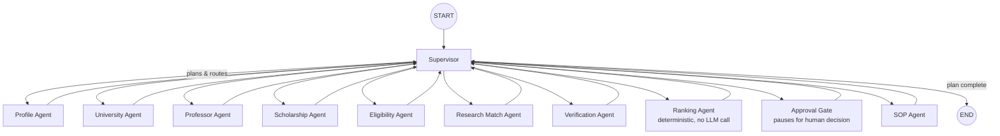

# EduPath AI

<div align="center">

**An AI-Powered Academic Opportunity Discovery & Multi-Agent Counseling Assistant**

[](https://www.python.org/)
[](https://fastapi.tiangolo.com/)
[](https://www.langchain.com/langgraph)
[](https://openrouter.ai/)
[](https://streamlit.io/)
[](https://www.postgresql.org/)
[](https://redis.io/)
[](https://www.docker.com/)
[](https://www.sqlalchemy.org/)
[](https://docs.pydantic.dev/)
[](https://docs.pytest.org/)
[](https://astral.sh/uv)

</div>

---

EduPath AI helps students discover PhD/Master's/undergraduate programs, scholarships, research
positions, and professors that genuinely match their academic profile — then helps them draft a
statement of purpose grounded in their real background. It's built as a multi-agent AI workforce,
not a chatbot: a supervisor coordinates nine specialized agents, each with a narrow responsibility,
communicating through a shared, typed LangGraph state.

## Problem Statement

Finding funded graduate opportunities means manually cross-referencing university admissions
pages, scholarship databases, faculty research pages, and eligibility requirements — a slow,
error-prone process, especially for international students juggling multiple countries and
funding sources. EduPath AI automates the discovery and matching, while treating hallucination as
the central risk to design against: every claim the system makes about a university, professor, or
funding source is either backed by real evidence (a database row or search result with a source
URL) or explicitly marked unverified. Nothing is invented.

## Features

- **Multi-agent discovery**: a Supervisor Agent plans and coordinates University, Professor,
  Scholarship, Eligibility, Research Match, Verification, and Ranking agents.
- **Structured, evidence-backed results**: every discovered opportunity carries `Evidence` (source
  URL, source type, verified/unverified) rather than a bare LLM claim.
- **Deterministic ranking**: opportunities are scored by a configurable, transparent weighted
  formula (research match, eligibility, funding, professor match, university tier, deadline
  urgency) — computed in Python, not guessed by an LLM.
- **Real human-in-the-loop**: the workflow genuinely pauses (via LangGraph's `interrupt()`) before
  SOP generation until you approve or reject an opportunity — not a cosmetic status flag.
- **SOP generation with memory**: statement-of-purpose drafts are persisted and versioned, and can
  be grounded in your uploaded CV/transcript via RAG.
- **Document upload + RAG**: upload a CV, transcript, or prior SOP (PDF/DOCX/TXT); it's chunked,
  embedded, and retrievable for SOP grounding.
- **Google OAuth + dev-mock login**: real Google sign-in when configured, with an automatic
  dev-mode fallback so the app is runnable without any OAuth setup.
- **Long-term memory**: every discovery run adds to a real, accumulating search history per
  student profile (not a single row overwritten each time).
- **Execution trace, execution graph, usage dashboard**: real per-agent status, inter-agent
  messages, the actual LangGraph topology, and real token/cost figures — never fabricated.
- **Excel export**: a 5-sheet workbook (Universities, Professors, Funding, Eligibility, Ranked
  Opportunities) built from the same data shown in the UI.

## Architecture

```text
┌──────────────────────────────────────┐
│          🎓 EduPath AI               |
│  Multi-Agent Study Abroad Counselor  │
└──────────────────┬───────────────────┘
                   │
                   ▼
┌─────────────────────────────────────────────────────────────────────────────┐
│                         PRESENTATION LAYER                                  │
│                                                                             │
│                         ┌──────────────────┐                                │
│                         │    Streamlit     │                                │
│                         │   Interactive UI │                                │
│                         └────────┬─────────┘                                │
│                                  │ HTTP / SSE                               │
└──────────────────────────────────┼──────────────────────────────────────────┘
                                   │
                                   ▼
┌─────────────────────────────────────────────────────────────────────────────┐
│                           FASTAPI BACKEND                                   │
│                                                                             │
│  ┌────────────────┐  ┌────────────────┐  ┌──────────────────────────────┐   │
│  │ Profile API    │  │ Counseling API │  │ HITL / Approval API          │   │
│  └────────────────┘  └───────┬────────┘  └──────────────────────────────┘   │
│                              │                                              │
│                              ▼                                              │
│                    ┌──────────────────────┐                                 │
│                    │   Session Manager    │                                 │
│                    └──────────┬───────────┘                                 │
└───────────────────────────────┼─────────────────────────────────────────────┘
                                │
                                ▼
┌─────────────────────────────────────────────────────────────────────────────┐
│                         LANGGRAPH ORCHESTRATION                             │
│                                                                             │
│                    ┌──────────────────────────────┐                         │
│                    │      SUPERVISOR AGENT        │                         │
│                    │                              │                         │
│                    │ • Understand user request    │                         │
│                    │ • Analyze degree level       │                         │
│                    │ • Route tasks                │                         │
│                    │ • Coordinate agents          │                         │
│                    │ • Monitor workflow           │                         │
│                    └──────────────┬───────────────┘                         │
│                                   │                                         │
│          ┌────────────────────────┼────────────────────────┐                │
│          │                        │                        │                │
│          ▼                        ▼                        ▼                │
│  ┌────────────────┐      ┌────────────────┐      ┌─────────────────┐        │
│  │ PROFILE        │      │ UNIVERSITY     │      │ SCHOLARSHIP     │        │
│  │ ANALYST AGENT  │      │ RESEARCH AGENT │      │ AGENT           │        │
│  │                │      │                │      │                 │        │
│  │ • CGPA         │      │ • Programs     │      │ • Scholarships  │        │
│  │ • Skills       │      │ • Universities │      │ • Funding       │        │
│  │ • Experience   │      │ • Ranking      │      │ • Eligibility   │        │
│  │ • Strengths    │      │ • Requirements │      │ • Deadlines     │        │
│  └───────┬────────┘      └───────┬────────┘      └────────┬────────┘        │
│          │                       │                        │                 │
│          │                       │                        │                 │
│          ▼                       ▼                        ▼                 │
│  ┌────────────────┐      ┌────────────────┐      ┌─────────────────┐        │
│  │ RESEARCH       │      │ PROFESSOR      │      │ DOCUMENT        │        │
│  │ DOMAIN AGENT   │      │ MATCHING AGENT │      │ AGENT           │        │
│  │                │      │                │      │                 │        │
│  │ • Research fit │      │ • Faculty      │      │ • SOP           │        │
│  │ • Domain       │      │ • Research     │      │ • LOR           │        │
│  │ • Skill gaps   │      │ • Similarity   │      │ • Email         │        │
│  │ • Trends       │      │ • Funding      │      │ • CV Feedback   │        │
│  └───────┬────────┘      └───────┬────────┘      └────────┬────────┘        │
│          │                        │                        │                │
│          └────────────────────────┼────────────────────────┘                │
│                                   ▼                                         │
│                     ┌──────────────────────────┐                            │
│                     │ RECOMMENDATION AGENT     │                            │
│                     │                          │                            │
│                     │ • University ranking     │                            │
│                     │ • Profile fit            │                            │
│                     │ • Funding fit            │                            │
│                     │ • Research fit           │                            │
│                     │ • Reach / Target / Safe  │                            │
│                     └────────────┬─────────────┘                            │
│                                  │                                          │
└──────────────────────────────────┼──────────────────────────────────────────┘
                                   │
             ┌─────────────────────┼──────────────────────┐
             │                     │                      │
             ▼                     ▼                      ▼
┌──────────────────────┐  ┌──────────────────────┐  ┌──────────────────────┐
│      TOOL LAYER      │  │    MEMORY / RAG      │  │   OBSERVABILITY      │
│                      │  │                      │  │                      │
│ • Web Search         │  │ • Student Memory     │  │ • Agent Logs         │
│ • University Search  │  │ • Conversation       │  │ • Agent Trace        │
│ • Scholarship Search │  │ • Previous Results   │  │ • Token Usage        │
│ • Professor Search   │  │ • Knowledge Base     │  │ • Cost Estimation    │
│ • Python Analysis    │  │ • RAG Retrieval      │  │ • Error Handling     │
│ • External APIs      │  │                      │  │ • Execution Time     │
└──────────┬───────────┘  └──────────┬───────────┘  └──────────┬───────────┘
           │                         │                         │
           └─────────────────────────┼─────────────────────────┘
                                     │
                                     ▼
                         ┌─────────────────────────┐
                         │       DATABASE          │
                         │                         │
                         │       SQLite /          │
                         │       PostgreSQL        │
                         │                         │
                         │ • Students              │
                         │ • Sessions              │
                         │ • Agent Messages        │
                         │ • Agent Runs            │
                         │ • Memories              │
                         │ • Recommendations       │
                         │ • Documents             │
                         │ • Human Feedback        │
                         └─────────────────────────┘
```

The frontend never talks to Gemini directly — every AI action goes through the backend. The
system combines a Streamlit client, FastAPI API, LangGraph orchestration, structured tool data,
and a persistent database/memory layer to produce evidence-backed recommendations and human-in-the-loop SOP generation.

See [`docs/architecture.md`](docs/architecture.md) for the full system design and
[`docs/workflow.md`](docs/workflow.md) for the LangGraph graph in detail.

## Multi-Agent Architecture



### Agent Descriptions

| Agent | Responsibility | Calls Gemini? |
|---|---|---|
| **Supervisor** | Plans the execution order (LLM on turn 1, reused after), routes control, detects rejection and ends early | Yes (once/run) |
| **Profile Agent** | Infers structured profile signals from the free-text request | Yes |
| **University Agent** | Discovers candidate universities/programs from real DB/search tool results | Yes (narrative only) |
| **Professor Agent** | Discovers candidate professors from real DB/search tool results | Yes (narrative only) |
| **Scholarship Agent** | Discovers candidate funding opportunities from real DB/search tool results | Yes (narrative only) |
| **Eligibility Agent** | Evaluates each candidate against the student's profile: verified/likely/unverified eligible | Yes |
| **Research Match Agent** | Scores research alignment (interest/technical/experience/program overlap) per candidate | Yes |
| **Verification Agent** | Audits whether each candidate's evidence actually supports its claims | Yes |
| **Ranking Agent** | Computes the final weighted score and order — pure Python, no LLM call | No |
| **Approval Gate** | Pauses the graph for a real human decision before SOP generation | No |
| **SOP Agent** | Produces SOP guidance as part of the discovery run (separate from the standalone `/sop/generate` endpoint) | Yes |

Discovery agents (University/Professor/Scholarship) **never** ask the LLM to invent structured
candidate data — candidates are built deterministically in Python straight from tool results
(`app/agents/context.py::candidates_from_tool_results`), so a candidate's id, URL, and metadata
can never be hallucinated. The LLM is only used to narrate/summarize what was actually found.

## LangGraph Workflow

The graph is a **hub-and-spoke** topology: the Supervisor is the only node with conditional
routing, and every worker node returns to it. This is a deliberate choice over parallel fan-out —
it keeps LLM API quota usage predictable and makes the execution trace easy to reason
about. See [`docs/workflow.md`](docs/workflow.md) for the full state schema and the
human-in-the-loop mechanics.

## Tech Stack

**Backend**: Python 3.14, FastAPI, LangGraph, Pydantic, SQLAlchemy (async), PostgreSQL + pgvector,
Redis, Alembic, OpenRouter API (`openrouter/free` + OpenAI embeddings), `pyjwt`, `google-auth`, `pypdf`, `python-docx`,
`openpyxl`, `httpx`, `structlog`, `uv` for dependency management.

**Frontend**: Streamlit, `requests`, native Streamlit theming (`.streamlit/config.toml`) + custom
CSS design system.

## Project Structure

```
edupath-ai/
├── backend/
│   ├── app/
│   │   ├── agents/            # One package per agent (supervisor, profile, university, ...)
│   │   ├── api/routes/        # FastAPI routers (auth, profiles, documents, workflows, sop, ...)
│   │   ├── auth/, core/       # config, security (JWT), redis client, exceptions, logging
│   │   ├── database/          # SQLAlchemy models + Alembic migrations
│   │   ├── graph/             # LangGraph state, routing, ranking, approval_gate, workflow.py
│   │   ├── llm/                # Gemini provider wrapper (retry/quota/cost)
│   │   ├── memory/             # Long-term memory (pgvector similarity search)
│   │   ├── repositories/       # DB access per entity
│   │   ├── schemas/             # Pydantic request/response models
│   │   ├── services/            # Business logic (workflow, profile, sop, document, export, auth)
│   │   └── tools/               # web_search, university_search, professor_search, opportunity_search
│   ├── scripts/seed_catalog.py # Curated real-university/scholarship seed data
│   └── tests/unit/             # 83 tests, all LLM calls mocked
├── streamlit_app/
│   ├── api/client.py           # Centralized backend HTTP client
│   ├── components/             # Reusable UI (cards, evidence, auth, sidebar, ...)
│   ├── pages/                  # Dashboard, Profile, Discover, Saved, Tracker, SOP, Trace, Graph, Memory, Usage, Settings
│   └── styles/main.css         # Design system CSS
├── infrastructure/docker/compose.yaml  # Postgres (pgvector) + Redis
└── docs/architecture.md, docs/workflow.md
```

## Installation

Prerequisites: Python 3.14+, [`uv`](https://docs.astral.sh/uv/), Docker (for Postgres/Redis).

```bash
git clone <repo-url>
cd edupath-ai
```

## Environment Variables

```bash
cd backend
cp .env.example .env
```

Fill in at minimum `GEMINI_API_KEY` and `JWT_SECRET_KEY` (generate one with
`python3 -c "import secrets; print(secrets.token_urlsafe(48))"`). Everything else has a sane
default — see [`backend/.env.example`](backend/.env.example) for every variable and what it does,
including the optional web-search provider and Google OAuth settings.

## Database Setup

```bash
cd infrastructure/docker
docker compose up -d          # Postgres (pgvector) + Redis

cd ../../backend
uv sync
uv run alembic upgrade head
uv run python scripts/seed_catalog.py   # curated real universities/scholarships
```

## Running the Backend

```bash
cd backend
uv run fastapi dev app/main.py
```

API docs at http://localhost:8000/docs.

## Running the Frontend

```bash
cd streamlit_app
python3 -m venv .venv && source .venv/bin/activate
pip install -r requirements.txt
streamlit run app.py
```

Open http://localhost:8501. See [`streamlit_app/README.md`](streamlit_app/README.md) for the
frontend structure and page-by-page notes.

## Example Workflow

1. Sign in (Google, or the dev-mode form if OAuth isn't configured).
2. Create your academic profile; optionally upload a CV/transcript.
3. On **Discover Opportunities**, describe what you're looking for (e.g. *"fully funded PhD in AI
   in the USA for Fall 2027"*) and click **Discover Opportunities**.
4. The Supervisor plans and runs the relevant agents; real candidates are discovered from the
   seeded catalog (or a configured web-search provider), scored, and ranked.
5. If the plan includes SOP generation, the workflow **genuinely pauses** — review the ranked
   opportunities and click **Approve & Generate SOP** or **Reject**.
6. Review/revise the generated SOP on the **Statement of Purpose** page (versioned).
7. Inspect **Agent Trace** and **Execution Graph** for exactly what ran, and **Export to Excel**
   for a shareable workbook.

## Screenshots

_Add screenshots of the Dashboard, Discover Opportunities, and Agent Trace pages here._

## API Documentation

Interactive OpenAPI docs are served at `/docs` and `/redoc` on the running backend
(http://localhost:8000/docs). Key route groups: `/api/v1/auth`, `/api/v1/profiles`,
`/api/v1/documents`, `/api/v1/workflows`, `/api/v1/opportunities`, `/api/v1/sop`,
`/api/v1/memory`.

## Testing

```bash
cd backend
uv run pytest -q
```

83 tests, all LLM calls mocked (`FakeProvider`/`MagicMock`) — no real Gemini calls, no cost, fully
deterministic. Frontend pages are verified with Streamlit's `AppTest` framework (executes real
page code without a browser); see the test files under `backend/tests/unit/` for the patterns.

## Future Improvements (P2, deliberately deferred)

- A real web-search provider integration (currently: curated seed data + honest "unavailable"
  reporting, since no provider key was available at build time).
- Individually seeded professor records (skipped — named-person bios/emails are the highest-risk
  hallucination surface and weren't live-verifiable).
- Cross-process-restart-durable LangGraph checkpointing (currently an in-process, cached
  `MemorySaver` — genuine pause/resume works within a running server session).
- Parallel agent fan-out in the graph (currently hub-and-spoke, chosen for predictable Gemini
  free-tier quota usage).
- Email drafting, additional countries, CI/CD.

## Team

Built by the EduPath AI team.
